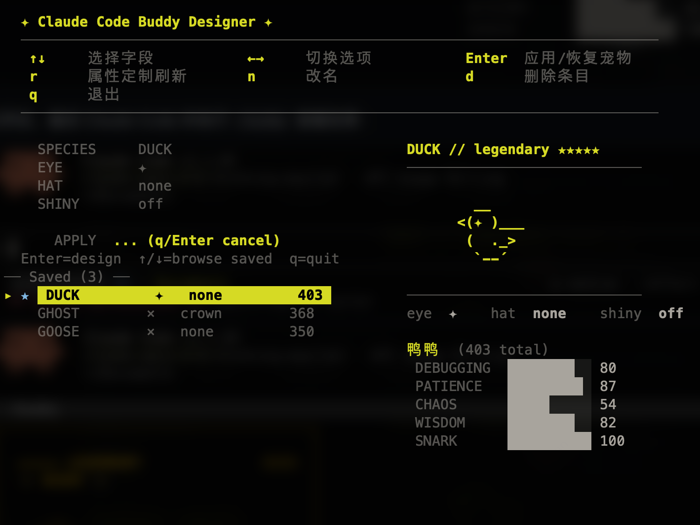
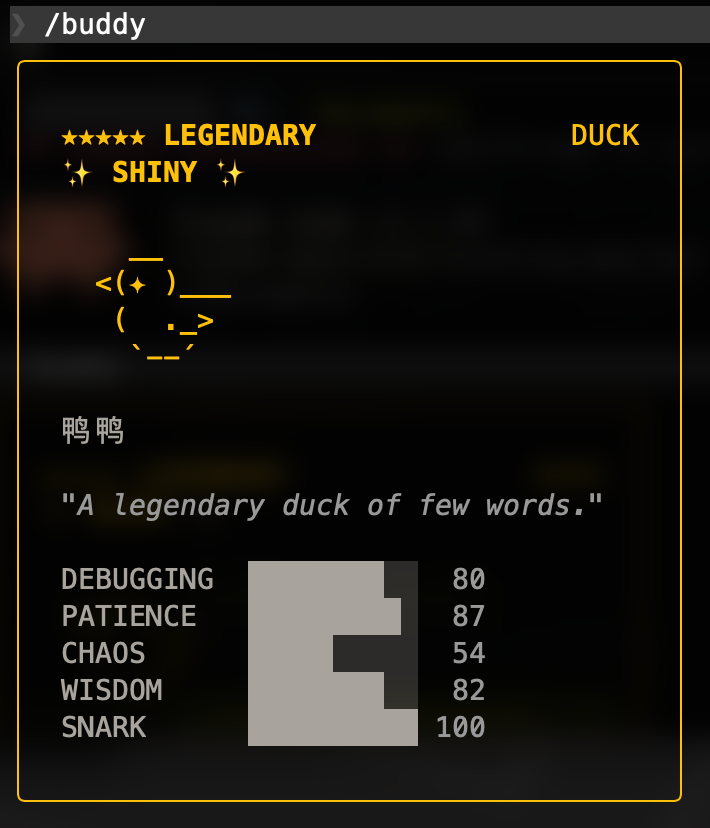

# Claude Buddy Designer

[English](README.md) | [中文](README.zh-CN.md)

Interactive TUI tool for designing your [Claude Code](https://claude.ai/code) companion buddy.

Pick your species, eyes, hat, and shiny — then apply instantly. No more random rolls.

> **Note:** Only works with API key users. OAuth login users are not supported.
>
> **Requires:** Claude Code **v2.1.89** or later. Run `/buddy` in Claude Code at least once before using this tool.



After applying, restart Claude Code and run `/buddy` to see the result:



## Features

- **18 species** — duck, goose, blob, cat, dragon, octopus, owl, penguin, turtle, snail, ghost, axolotl, capybara, cactus, robot, rabbit, mushroom, chonk
- **Full attribute control** — species, eye style, hat, shiny toggle
- **Live preview** — animated ASCII sprite with idle sequence matching Claude Code
- **Collection manager** — auto-saves legendaries, browse and restore anytime
- **Targeted stat reroll** — enter stat customization mode, set per-stat direction (↑ higher / ↓ lower), then reroll. Defaults: DEBUGGING↑ PATIENCE↑ CHAOS↓ WISDOM↑ SNARK↓
- **Rename** — give your buddy a custom name (supports CJK characters)
- **Shiny preservation** — rerolling a shiny buddy guarantees shiny results
- **Auto-detection** — detects native (bun) vs npm (node) Claude Code installs and uses the correct hash function

## Install

### 1. Install Bun

```bash
# macOS / Linux
curl -fsSL https://bun.sh/install | bash

# Windows (via PowerShell)
powershell -c "irm bun.sh/install.ps1 | iex"

# or via Homebrew
brew install oven-sh/bun/bun
```

### 2. Run

```bash
bun buddy-designer.mjs
```

## Controls

### Design Mode

| Key | Action |
|-----|--------|
| `↑` `↓` | Navigate fields / saved entries |
| `←` `→` | Cycle species, eye, hat, shiny |
| `Enter` | Apply design or restore a saved buddy |
| `r` | Enter stat reroll setup (on saved entries) |
| `n` | Rename buddy (on saved entries) |
| `d` | Delete saved entry |
| `q` | Quit |

### Stat Reroll Setup (after pressing `r`)

| Key | Action |
|-----|--------|
| `↑` `↓` | Select stat to configure |
| `Enter` | Toggle direction (↑ higher / ↓ lower) |
| `r` | Start rerolling with current constraints |
| `Esc` / `q` | Cancel and return to design mode |

Default directions: DEBUGGING↑ PATIENCE↑ CHAOS↓ WISDOM↑ SNARK↓. All constraints must be satisfied simultaneously. Stats at their limit (100 or 1) are allowed to stay equal.

### Rename Mode (after pressing `n`)

| Key | Action |
|-----|--------|
| Type | Enter new name (max 20 chars, supports Chinese) |
| `Enter` | Confirm |
| `Esc` | Cancel |

## How It Works

Claude Code generates buddy attributes deterministically from `hash(userID + SALT)` using a seeded PRNG ([Mulberry32](https://gist.github.com/tommyettinger/46a874533244883189143505d203312c)). This tool finds a userID that produces your desired combination by brute-force searching the hash space.

- **Native CC** (installed via `claude` installer) uses `Bun.hash` (wyhash)
- **npm CC** (installed via `npm i -g @anthropic-ai/claude-code`) uses FNV-1a

The tool auto-detects which hash function your Claude Code uses and searches accordingly.

### What it changes

Only two fields in your Claude Code config file (`~/.claude.json` or equivalent):

- `userID` — determines the buddy's appearance and stats
- `companion` — stores the buddy's name and personality

Your authentication, settings, and everything else remain untouched.

## Saved Collection

Legendaries are saved to `~/.claude/buddy-legendaries.json`. Each entry records:

- Species, eye, hat, shiny status
- Full stat block (DEBUGGING, PATIENCE, CHAOS, WISDOM, SNARK)
- Custom name
- UserID (for restoring later)
- Timestamp

The `★` marker shows which buddy is currently active.

## FAQ

**Q: Will this break my Claude Code?**
A: No. It only modifies `userID` and `companion` in the config file. Claude Code re-derives the buddy appearance on each startup. Your auth tokens and settings are not affected.

**Q: Can I go back to my old buddy?**
A: Yes. All applied buddies are saved to the collection. Select any entry and press Enter to restore.

**Q: Does this work with OAuth login?**
A: No. OAuth users' buddy is determined by `oauthAccount.accountUuid`, which this tool does not modify. Only API key users are supported.

**Q: Why does searching for shiny take so long?**
A: Shiny has a 1% chance per roll, on top of legendary's ~1% chance and the specific species/eye/hat combo. That's roughly 1 in 10 million. Be patient — it will find one.

**Q: Why is the stat reroll taking forever?**
A: All 5 stat constraints must be satisfied simultaneously. If a stat is already at its limit (e.g., 100), the tool allows it to stay equal. But very high stats across the board are extremely rare. Try toggling some stats to ↓ to relax the constraints.

**Q: Does this work on Linux?**
A: Yes, as long as you have Bun installed. Note that on some cloud VMs, Claude Code may need a restart to pick up the config change.

## License

[MIT](LICENSE)
